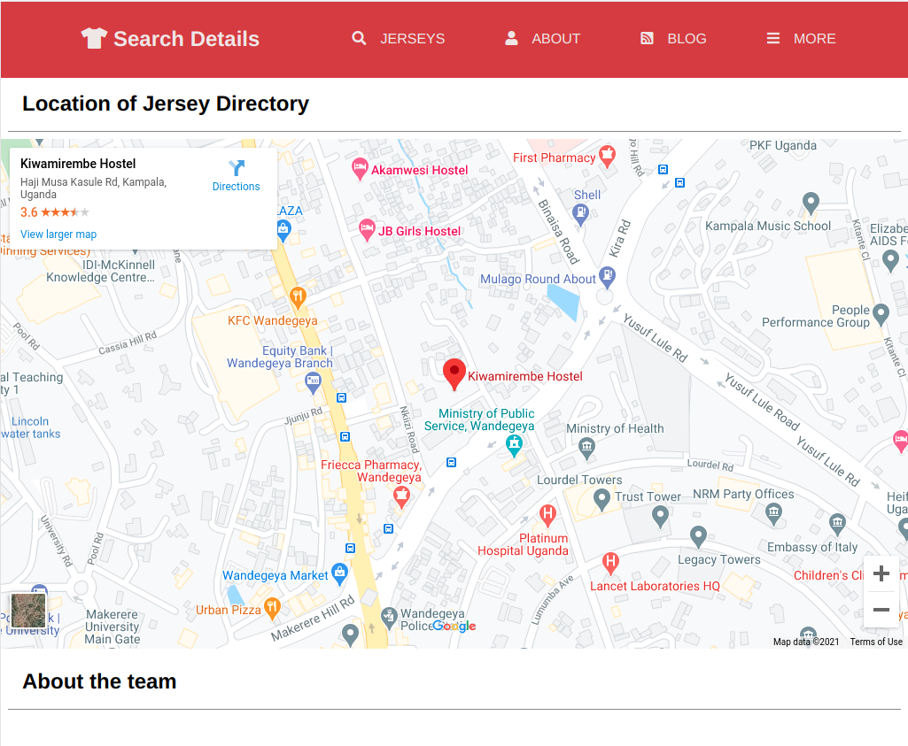

# JERSEY DIRECTORY


## About
> jersey-directory is a web app that enhances the shopping experience of customers in need of custom tailored jerseys to suite their needs through a simplified visual walk-through.

It has 3 pages. A main landing page, search page and search details page made responsive with a mobile first approach across different screen sizes.

## Main Page 
### Home Landing
|  | |  | 
|:---:|:---:|:---:|
| Mobile view | Tablet view | Laptop view |

### Home Example
|  | |  | 
|:---:|:---:|:---:|
| Mobile view | Tablet view | Laptop view |

### Footer
|  | |  | 
|:---:|:---:|:---:|
| Mobile view | Tablet view | Laptop view |

## Search Page
|  | |  | 
|:---:|:---:|:---:|
| Mobile view | Tablet view | Laptop view |

## Search Details Page
|  | |  | 
|:---:|:---:|:---:|
| Mobile view | Tablet view | Laptop view |

## Built With

- HTML5 & CSS3
- No frameworks

## Live Demo

[Live Demo Link](https://kabohajeanmark.github.io/jersey-directory/)

## Instructions
To get a local copy up and running follow these simple example steps.

### Prerequisites
- Gitbash installed to navigate between the branches.
- A preferred text editor for example VS Code.
- A browser such as Google Chrome

### Install
Clone this [GitHub Repo](https://github.com/KabohaJeanMark/jersey-directory/tree/ft-main-page) to your computer on yourFolder by typing these commands in the terminal or download as a Zip file and extract.
```
$ mkdir yourFolder
$ cd yourFolder
$ git clone https://github.com/KabohaJeanMark/jersey-directory/tree/ft-main-page
```

### Usage
- View with live Server in VS code or Right click and open the index.html in your browser to view.

## Author

👤 **Kaboha Jean Mark**

- GitHub: [@KabohaJeanMark](https://github.com/KabohaJeanMark)
- Twitter: [@jean_quintus](https://twitter.com/jean_quintus)
- LinkedIn: [Jean Mark Kaboha](https://www.linkedin.com/in/jean-mark-kaboha-software-engineer/)


## 🤝 Contributing

Contributions, issues, and feature requests are welcome!

Feel free to check the [issues page](https://github.com/KabohaJeanMark/jersey-directory/issues).

## Show your support

Give a ⭐️ if you like this project!

## Acknowledgments

- Hat tip to Microverse for the README template, instructions and tutoring for this Capstone project.

## Inspirations
- Design idea by [Mathew Njuguna and others on Behance](https://www.behance.net/mathewnjuguna)

## 📝 License

This project is [MIT](./LICENSE) licensed.